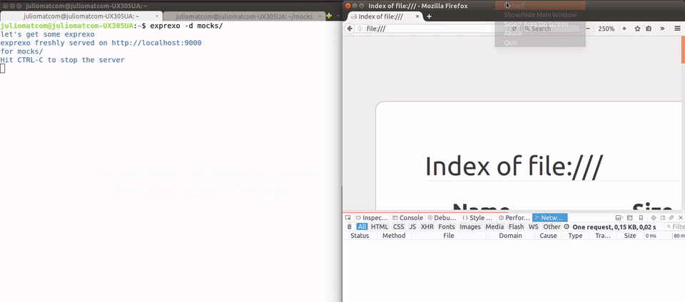

# exprexo
[](http://standardjs.com/) [](https://travis-ci.org/exprexo/exprexo) [](https://codeclimate.com/github/exprexo/exprexo) [](https://codeclimate.com/github/exprexo/exprexo/coverage) [](https://www.npmjs.com/package/exprexo)
[](#contributors-) [](https://github.com/semantic-release/semantic-release)

hacked javascript freshly served


# What is exprexo
     

**exprexo** is a zero-configuration command-line javascript server. Think about it like `http-server` but with dinamic **.js** files execution alongside of statics.

**exprexo** allows creating mocks easily and fast. Just run **exprexo** in any folder
containing some paths with a `get.js` file and open your browser using the same path as the url.
Your paths, your API.

# Installing globally

Installation via `npm`:

    npm install exprexo -g

This will install **exprexo** globally so that it may be run from the command line.

> exprexo and javascript make the perfect blend

## Usage

    exprexo [path] [options]


## Available Options

```
Usage: exprexo [path] [options]

Mode
  --silent, -s  Make this exprexo in silence          [boolean] [default: false]
  --verbose     Make this exprexo loud as hell        [boolean] [default: false]

Options:
  --directory, -d  A cool directory to be served           [default: "./routes"]
  --open, -o       Open your browser at the served page         [default: false]
  --port, -p       A cool port for your exprexo                           [9000]
  --help           Show help                                           [boolean]
  --version        Show version number                                 [boolean]

```


## Get started

### Basic example, serving a simple JSON

On a terminal, run:

```
$ mkdir cool-stuff
$ cd cool-stuff
```

Create a file named `get.json` that may look as follows:

```js
{
  "hello": "exprexo"
}
```

For having your **exprexo** served, run:

```
$ exprexo . --open
```

**NOTE:** The `.` tells **exprexo** to serve the same folder it is running on.
 The `--open` flag will open a browser at the given url.


### Deeper routes

Let's create a deeper endpoint, run:

```
$ mkdir -p routes/cool/user
$ cd routes/cool/user
```

Create a file named `get.json` that may look as follows:


```js
{
  "id": "537",
  "name": "Mr Coffee",
  "nickname": "exprexo"
}
```

Now run the following and browse `http://localhost:9000/cool/users`

```
$ exprexo
```

**NOTE:** Notice there is no `.` argument, **exprexo** will serve `routes`
folder by default.


### And now some javascript!

Create a file named `get.js` inside `routes/cool/user/` that may look as follows:


```js
module.exports = {
  id: Math.floor(Math.random() * 20),
  name: 'Mr Coffee',
  nickname: 'exprexo'
}
```

**NOTE:** **exprexo** will try to serve at first **\*.js** files, then
**\*.json**.


### Read query params


Modify `get.js` inside `routes/cool/user/` so it may look as follows:


```js
module.exports = function (req, res) {
  const user = {
    id: Math.floor(Math.random() * 20),
    name: req.query.name,
    nickname: 'exprexo'
  }
  res.send(user)
}
```

Now run the following and open `http://localhost:9000/cool/users/?name=cool`

```
$ exprexo
```

**NOTE:** **exprexo** uses the same API as any **express** middleware.
Define `req` and `res` as your function arguments and it's done.
If you prefer a classic `return` statement **exprexo** will send that for you.


### What about POST, PUT, PATCH and DELETE?

**exprexo** got you covered! Noticed how we have been creating `get.json` or
`get.js` files? **exprexo** will match any request method to a file with the
same method name.

Want a new **POST** endpoint?
Create a `post.json` or `post.js`, it's that easy.

You can create the following supported methods:

| Method        | exprexo file name             |
| ------------- | ----------------------------- |
| GET           | `get.json` or `get.js`        |
| POST          | `post.json` or `post.js`      |
| PUT           | `put.json` or `put.js`        |
| PATCH         | `patch.json` or `patch.js`    |
| DELETE        | `delete.json` or `delete.js`  |


### More examples

Visit the [examples](https://github.com/exprexo/exprexo/tree/master/examples) directory for some other demos like:

  * a simple counter
  * a function with no `res.send`
  * some html with template literals
  * some html with **pug** or **jade**


# Thanks
indexzero for the great and inspirational `http-server`

# Developing

## Releases

This tool is automatically released with [semantic-release](https://github.com/semantic-release/semantic-release) 🤖.

Travis's stage `release:deploy` runs **package.json** script `npm run semantic-release` using the config file **release.config.js**.

Please see **.travis.yml** for more details.

# Todos
* [ ] add ssl/https

## Contributors ✨

Thanks goes to these wonderful people ([emoji key](https://allcontributors.org/docs/en/emoji-key)):

<!-- ALL-CONTRIBUTORS-LIST:START - Do not remove or modify this section -->
<!-- prettier-ignore-start -->
<!-- markdownlint-disable -->
<table>
  <tr>
    <td align="center"><a href="https://github.com/alvaropinot"><br /><sub><b>Alvaro Pinot @alvaropinot</b></sub></a><br /><a href="https://github.com/exprexo/exprexo/commits?author=alvaropinot" title="Code">💻</a> <a href="https://github.com/exprexo/exprexo/commits?author=alvaropinot" title="Documentation">📖</a></td>
    <td align="center"><a href="https://github.com/leireNN"><br /><sub><b>Leire Polo</b></sub></a><br /><a href="https://github.com/exprexo/exprexo/commits?author=leireNN" title="Documentation">📖</a></td>
    <td align="center"><a href="https://juliocesar.space/"><br /><sub><b>J.C. Martin</b></sub></a><br /><a href="https://github.com/exprexo/exprexo/commits?author=juliomatcom" title="Documentation">📖</a></td>
  </tr>
</table>

<!-- markdownlint-enable -->
<!-- prettier-ignore-end -->
<!-- ALL-CONTRIBUTORS-LIST:END -->

This project follows the [all-contributors](https://github.com/all-contributors/all-contributors) specification. Contributions of any kind welcome!

# License

MIT - [@alvaropinot](http://twitter.com/alvaropinot) Alvaro Pinot

Logo - Based on *Coffee*
By *Gregor Črešnar* from the *Noun Project*

